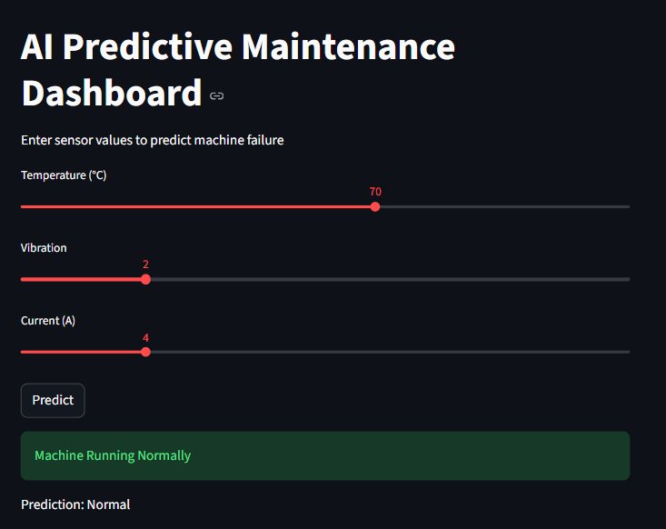
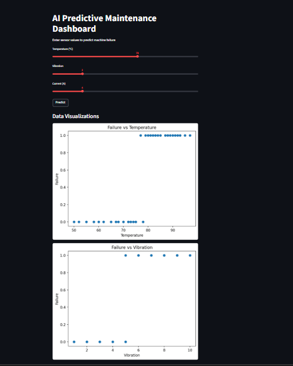
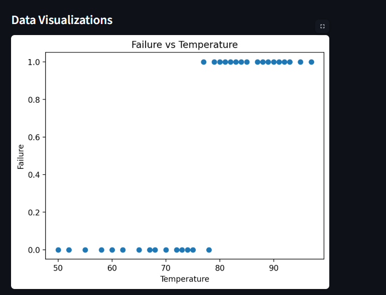
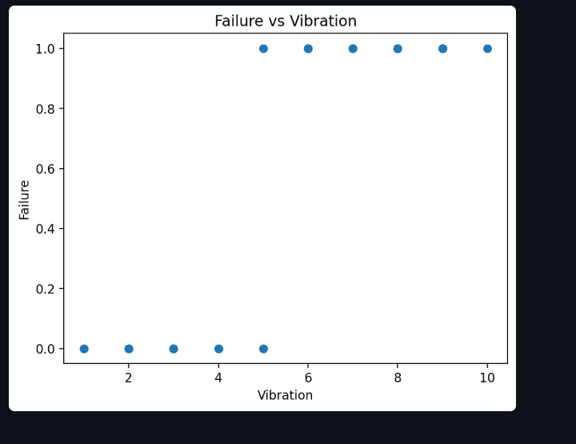

AI Predictive Maintenance System (IoT + Machine Learning)

"Python" (https://img.shields.io/badge/Python-3.9-blue)
"ML" (https://img.shields.io/badge/Machine%20Learning-RandomForest-green)
"Streamlit" (https://img.shields.io/badge/Framework-Streamlit-red)

Overview

An end-to-end Machine Learning project that predicts industrial machine failures using IoT sensor data and provides real-time insights through an interactive dashboard.

Problem Statement

Unexpected machine failures in industries lead to:

• Production downtime
• High maintenance costs
• Safety risks

This project solves the problem using predictive maintenance, where failures are predicted before they occur using sensor data.

Solution

This system uses IoT sensor data such as:

• Temperature
• Vibration
• Current

A Random Forest Machine Learning model is trained to classify:

• Normal Operation
• Potential Machine Failure

Key Features

• End-to-end ML pipeline (Data → Training → Prediction)
• Real-time IoT data simulation
• Interactive dashboard using Streamlit
• Machine failure prediction using Random Forest
• Data visualization and insights
• Modular and scalable project structure

## Dashboard Preview

### Main Dashboard

### Data Visualizations

### Failure vs Temperature

### Failure vs Vibration

Sample Output

• Input: Temperature=75, Vibration=0.8, Current=12
• Output: Potential Machine Failure

Tech Stack

• Python
• Pandas, NumPy
• Scikit-learn
• Matplotlib
• Joblib
• Streamlit

Project Structure

AI-Predictive-Maintenance-IoT/
│
├── data/
├── models/
├── outputs/
├── images/
├── src/
│
├── preprocess.py
├── train.py
├── predict.py
├── visualize.py
├── simulator.py
│
├── app.py
├── main.py
│
├── requirements.txt
└── README.md

How It Works

1. Data is loaded and cleaned
2. Model is trained using historical sensor data
3. Model is saved using Joblib
4. New sensor data is passed for prediction
5. Dashboard displays results in real-time

How to Run

1. Clone Repository

git clone https://github.com/Nikhatjahan85/AI-Predictive-Maintenance-IoT.git
cd AI-Predictive-Maintenance-IoT

2. Install Dependencies

pip install -r requirements.txt

3. Train Model

python train.py

4. Run Dashboard

streamlit run app.py

Future Improvements

• Deploy on cloud (AWS / Azure)
• Integrate real IoT hardware
• Use deep learning models
• Add alert system (SMS/Email notifications)

Author

Nikhat Jahan
GitHub: https://github.com/Nikhatjahan85
